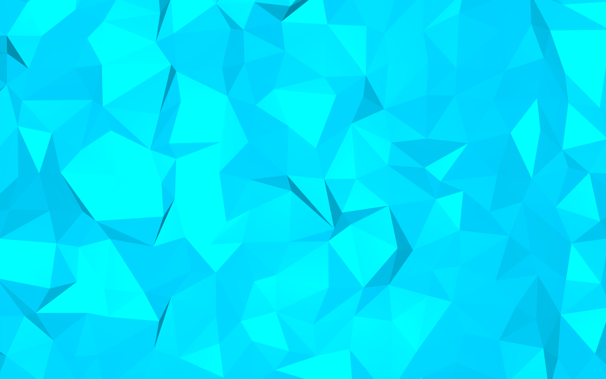

# Fractal Generation Script

***NEW*** Now with rainbow colors!!



#### How to use:

```
cd ~/mydirectory/
blender
```

Then run the script from blender's text editor

#### TODO:

Convert mycolors to return contiguous float rgb values. (So that colors line up from one rendered image to the next.) Gonna need to learn how to make contiguous colors.


